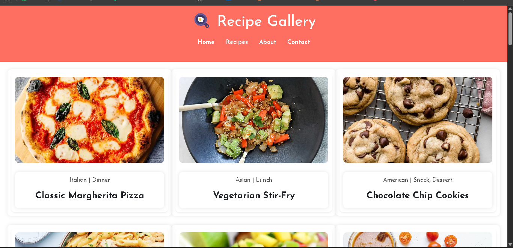
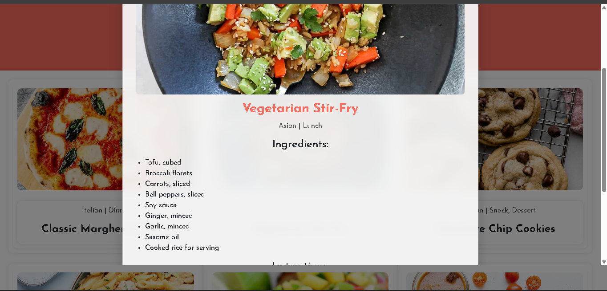

# 🍳 Recipe Gallery App

A modern, responsive recipe gallery built using **HTML**, **CSS**, **Bootstrap**, and **JavaScript**.
This app fetches real-time recipe data from the [DummyJSON Recipes API](https://dummyjson.com/recipes) and displays them in a stylish card layout.
Users can hover over recipe images to view a search icon and click it to open a **modern modal** with full recipe details — including ingredients, cuisine, meal type, and instructions.

---

## 🚀 Features

* ✅ Dynamic recipe data fetched from live API (`https://dummyjson.com/recipes`)
* 🖼️ Responsive grid layout using **Bootstrap 5**
* 🤭 Interactive **hover overlay** with search icon
* 🍲 **Modal popup** for recipe details
* 🧩 Header and footer dynamically generated using JavaScript
* 💅 Google Fonts + Material Icons for modern look
* 📱 Fully responsive (works on mobile, tablet, desktop)

---

## 📂 Project Structure

```
Recipe-Gallery-App/
│
├── index.html
├── CSS/
│   └── style.css
├── JavaScript/
│   └── script.js
└── README.md
```

---

## 🔧 Technologies Used

| Type          | Tools / Libraries Used                                 |
| ------------- | ------------------------------------------------------ |
| Frontend      | HTML5, CSS3, JavaScript (ES6)                          |
| Framework     | Bootstrap 5.3.3                                        |
| Fonts & Icons | Google Fonts (Josefin Sans), Material Icons            |
| API Source    | [DummyJSON Recipes API](https://dummyjson.com/recipes) |

---

## ⚙️ Setup & Usage

1. **Clone or Download** this project:

   ```bash
   git clone https://github.com/vaishalivala17/My-Recipes_App.git
   ```

2. Open the project folder and run `index.html` in your browser.

3. Hover over any recipe image → click the **search icon 🔍** → view full details in a modal popup.

---

## 📸 Screenshots

| Homepage                      | Modal View                      |
| ----------------------------- | ------------------------------- |
|  |  |

---

## 🎨 Future Enhancements

* 🔍 Add live search and filter options
* ❤️ Add "Favorite" and "Save Recipe" features
* 🌙 Dark mode toggle
* 🍽️ Pagination for large datasets

---

## 👩‍💻 Developer Info

**Developed by:** Vaishali Vala
📧 Email: *[Add your email]*
🗕️ Year: 2025
🌐 Course: Full Stack Development @ Red & White Institute

---

> *“Good food is all the sweeter when shared with good design.”* 🍰
